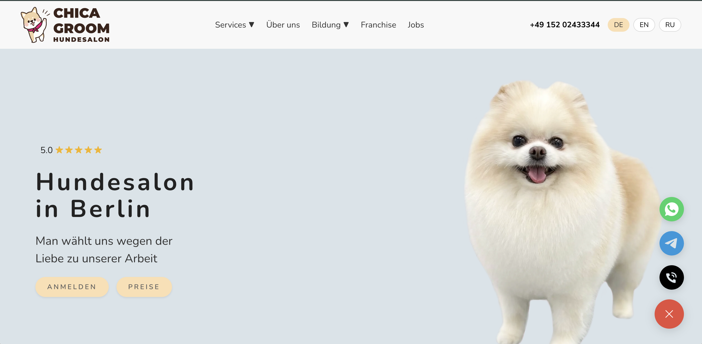
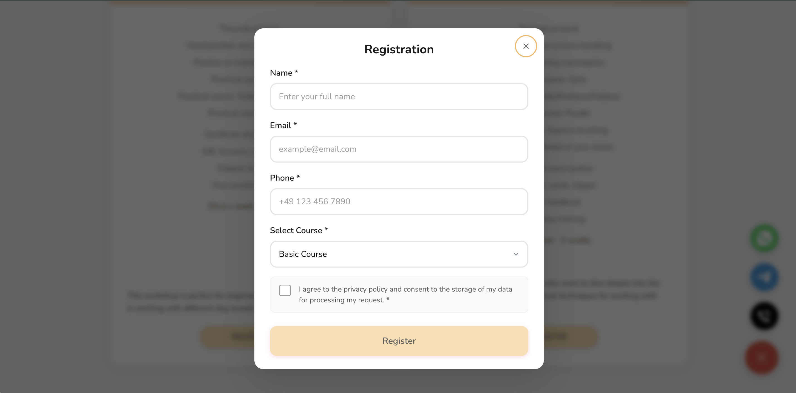
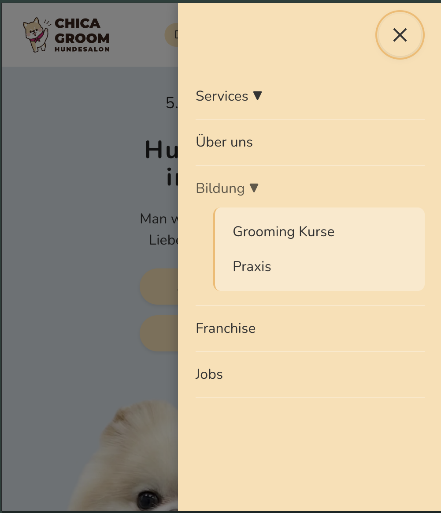
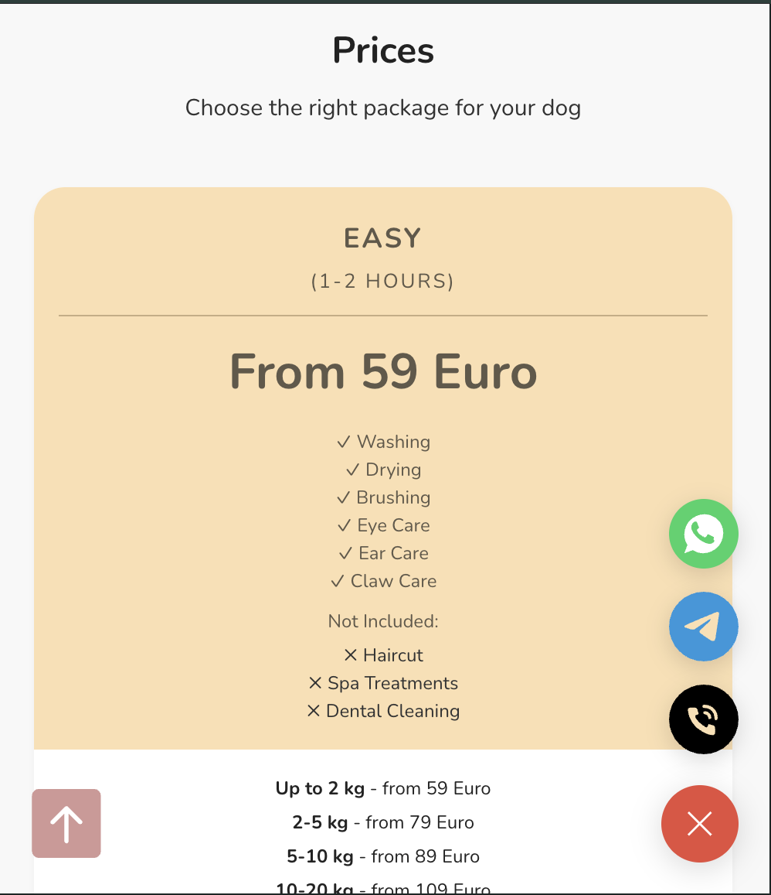

[](https://github.com/maratryspekov/chica-groom/actions/workflows/ci.yml)
[](https://playwright.dev/)
[](https://chica-groom.vercel.app)

# 🐾 Chica Groom

Modern website for a dog grooming salon in Berlin, Germany.

🚀 **[Live Demo](https://chica-groom.vercel.app)** | 📧 [Contact](mailto:chicagroom@gmail.com)

  

## 📝 About

A full-stack web application for a dog grooming business featuring online booking, course registration, and multi-language support. Built as a portfolio project to demonstrate React, TypeScript, and Node.js skills.

## 📸 Screenshots

### Desktop Version

<div align="center">
  
  <p><em>Homepage with hero section and service overview</em></p>
</div>

<div align="center">
  
  <p><em>Course registration modal with form validation</em></p>
</div>

### Mobile Version

<div align="center">
  
  
  <p><em>Animated hamburger menu and responsive service cards</em></p>
</div>

## ✨ Features

- 🌐 **Multi-language support** - German, English, Russian
- 📱 **Fully responsive** - Mobile-first design
- 📝 **Multiple forms** - Booking, courses, jobs, workplace rental
- 🤖 **Telegram integration** - Real-time notifications
- ♿ **Accessible** - ARIA labels, keyboard navigation

## 🏆 Quality & Standards

This project follows modern web development best practices:

- ✅ **TypeScript** - Type-safe code with full type coverage
- ✅ **ESLint** - Code quality and consistency checks
- ✅ **SCSS Modules** - Scoped styling, no naming conflicts
- ✅ **Responsive Design** - Mobile-first, tested on all devices
- ✅ **Accessibility (a11y)** - WCAG compliant, keyboard navigation, ARIA labels
- ✅ **SEO Optimized** - Semantic HTML, meta tags, proper heading structure
- ✅ **Performance** - Lazy loading, optimized images, code splitting
- ✅ **Clean Architecture** - Modular component structure, separation of concerns
- ✅ **i18n Ready** - Full internationalization support with i18next
- ✅ **CI** - GitHub Actions (lint, typecheck, e2e on push/PR)
- ✅ **E2E Tests** - Playwright (booking form + language switch)
- ✅ **Test Artifacts** - Screenshots/traces on failures

## 🛠 Tech Stack

**Frontend:**

- React 19 + TypeScript
- React Router (routing)
- i18next (internationalization)
- SCSS Modules (styling)
- Vite (build tool)

**Backend:**

- Node.js + Express
- Telegram Bot API
- CORS, dotenv

## 📂 Project Structure

```
src/
├── components/
│   ├── common/          # Button, Container, Modal
│   ├── layout/          # Header, Footer, Layout
│   └── sections/        # Homepage sections
├── pages/               # Home, Courses, Jobs, etc.
├── locales/            # de.json, en.json, ru.json
├── styles/             # Global SCSS
└── main.tsx

server/
└── telegramServer.js    # Express API + Telegram bot
```

## 🚀 Getting Started

### Prerequisites

- Node.js 22+
- Telegram bot token (for notifications)

### Installation

1. Clone and install:

```bash
git clone <repo-url>
cd chica-groom
npm install
```

2. Setup environment variables:

Copy `.env.example` to `.env` and fill values:

```bash
cp .env.example .env
```

Never commit `.env` files. They are ignored by `.gitignore`.

3. Run development servers:

**Terminal 1 - Frontend:**

```bash
npm run dev
# Runs on http://localhost:5173
```

**Terminal 2 - Backend:**

```bash
npm run server
# Runs on http://localhost:3000
```

## 📡 API Endpoints

All endpoints send POST requests to Express server, which forwards to Telegram:

- `POST /api/booking` - Service bookings
- `POST /api/courses` - Course registrations
- `POST /api/franchise` - Franchise inquiries
- `POST /api/practice` - Internship applications
- `POST /api/workplace` - Workplace rental
- `POST /api/jobs` - Job applications

**Example request:**

```json
{
  "name": "John Doe",
  "email": "john@example.com",
  "phone": "+49123456789",
  "coursePackage": "Basic Course",
  "privacyConsent": true
}
```

## 🌍 Languages

Supports 3 languages with full translation:

- 🇩🇪 German (default)
- 🇬🇧 English
- 🇷🇺 Russian

Language selection persists via localStorage. Translation files in `src/locales/`.

## 🎨 Key UI Features

- **Responsive design** - Mobile-first with breakpoints at 768px and 1024px
- **Animated hamburger menu** - Smooth transitions on mobile
- **Before/After slider** - Interactive image comparison
- **Modal forms** - Accessible with focus trapping
- **Scroll animations** - Paw print marquee effect

## 🏗 Build & Deploy

```bash
# Build for production
npm run build

# Preview build
npm run preview
```

Deploy frontend to Netlify/Vercel, backend to Railway/Render.

## 🧠 What I Learned

- Building responsive layouts with SCSS Modules
- Implementing i18next for multi-language support
- Creating accessible forms with ARIA attributes
- Integrating Express backend with React frontend
- Working with Telegram Bot API
- TypeScript for type-safe React development

## 📫 Contact

**Marat Ryspekov**

Portfolio project demonstrating React, TypeScript, and Node.js skills.

---

Built with React, TypeScript, and Express.js
